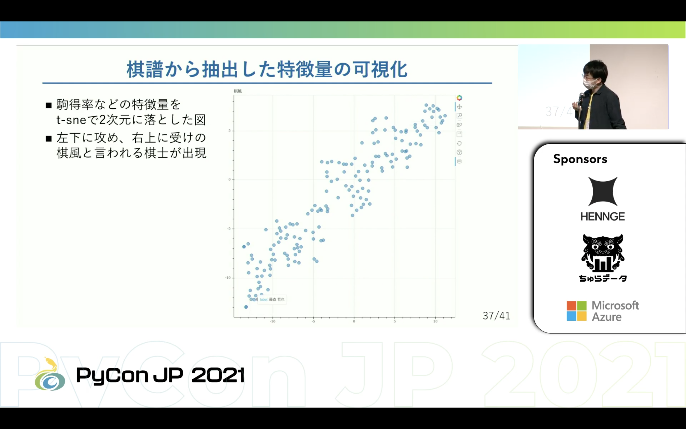

# PyCon JPとは

[PyCon JP](https://www.pycon.jp/)は日本国内外のPythonユーザーが一堂に会し、互いに交流を深め、知識を分け合い、新たな可能性を見つけられる場所として毎年開催される国際カンファレンスです。

[PyCon JP 2021](https://2021.pycon.jp/)は2021年10月15日〜16日のカンファレンスと2日間の会期で開催されました。

昨年のPyCon JP 2020では新型コロナウイルス感染症(COVID-19)の影響でオンライン開催のみでしたが、PyCon JP 2021では感染状況を考慮して、初日(10月15日)はオンサイト会場(ベルサール神田)とオンラインのハイブリッド、2日目(10月16日)はオンラインのみでの開催となりました。

ハイブリッド開催は初の試みでしたが、オンサイト会場には30名近くの参加者が来場し久しぶりにリアルのカンファレンスを感じていただき、オンラインにも多くの参加者が訪れて下さいました。
また16日のオンライン開催も、多数の参加者・視聴者の方が訪れて下さり大盛況のうちに PyCon JP 2021 は幕を閉じました。

今回は15日に行われたカンファレンスの中から、注目セッションと感想について運営スタッフがレポートします。

## 基調講演「将棋とPythonの素敵な出会い」 - 谷合廣紀氏

(吉田 健太)

1日目のキーノートセッションは、谷合 廣紀氏が登壇しました。谷合氏はプロの棋士であると同時にPythonistaであり、「[pythonで理解する統計解析の基礎](https://gihyo.jp/book/2018/978-4-297-10049-0)」という書籍も執筆されています。

発表ではまず「棋士とAIの関係」について語られました。「チェスは人工知能のショウジョウバエ」と言われており、日本では将棋を題材に進化していき、近年では電王戦が代表的に棋士とAIが戦うといったイベントも開かれました。結果、事実上プロ棋士に勝利し今後棋士としての仕事はあるのかという心配もありましたが、現在ではライブ放送で棋譜を予想し勝率をリアルタイムに計測したり、AIの評価を参考にして棋士の研究パートナーとして共存しています。

谷合氏は棋譜の将棋AIとして大きく2つにわかれていると説明します。

- αβ法系
  - これまでの主流でCPUを活用し読みの速度が高速
  - 探索局面を大量に生やすことで評価精度を上げている
- DL系
  - ここ数年で発展が目覚ましく、GPUを活用する関係でマシンパワーが必要
  - 方策ネットワークを使用しゲーム木を探索していく

αβ法ではC++などで高速化しているのに対してDL系はモデル部分はCNNを用いているためPythonで書くことができます。DL系では盤面全体を9×9×Cとしており、王金銀など周囲一マスしか移動できない駒の場合は良いが飛角香といった飛び駒と呼ばれる2つ以上移動できるコマの場合は3×3Convの範囲外になってしまい全体としての特徴を掴みづらいという点を加味し、Transformerを用いれば特徴量を単層として捉えるのでは？と疑問を持っていました。先駆者は少なかったため自分で作ってみようということで[BERT-MCTS](https://github.com/nyoki-mtl/bert-mcts-youtube) というBERTとMCTSを組み合わせたAIを新たに作成されました。実際に将棋に造詣があるYoutuberと対戦した動画も公開されています。

BERTはGoogleが開発した自然言語処理モデルです。探索部分は盤面を文字列として変換し、チェスや将棋などで用いられることが多いMCTSを使用しています。BERTに代表される自然言語処理モデルは事前学習が大事だと一般的に言われており、BERTではMaskedLanguageModelという大規模事前学習を可能にする手法が使用されています。教師データなしで事前学習が可能ということを期待し、実際にBERT-MCTSにも取り入れたものの、現在将棋AIの世界では強い棋士の棋譜や強いAIの棋譜など良質な教師データがたくさんあり、今回はこの事前学習はそこまでメリットを感じないと説明しつつ、教師データが少ない場合では有用であるとも述べていました。

youtubeで使用したBERT-MCTSは2・3日で作成できたと言い、短時間で作成できた要因として書き慣れたPythonであること・Pythonには機械学習に対応したライブラリが豊富であることを挙げています。
他にも、将棋にAttention層を使うことで盤面において上級者がどこに注力しているかの可視化を行ったり、棋譜から特徴量を抽出して可視化した際に「棋風」というものが存在した話などここでは書ききれないコアな話をエンジニア・棋士の両側面から話されました。

最後にまとめとして「棋士×エンジニア」という自身の経験から、将棋界とITを知っているからこそ解決できる問題が認識でき、それを自分で作れるということが一番の強みとし、今後はPyConJPでの発表をはじめ「棋士×何か」という将棋界以外のものが増えてくるのではないかと予想しました。

そして今後の将棋とITの今後に関しては、将棋自体はAIが超えてはいるもののまだまだ手動で行う作業も多く、様々な改善の余地があり、DL系の台頭によりそれまでC＋＋でしかかけなかった将棋AIがPythonで書けるようになったことで敷居が下がり、他の機械学習モデルをPythonで勉強していたエンジニアも参入しやすくなったとまとめています。

より詳細な使用ライブラリや棋風とは何か気になった方は[こちらから動画アーカイブや発表資料](https://2021.pycon.jp/time-table/?id=290208)を御覧ください。

## セッション「Python x DDD!! - Python で学ぶ実践的なドメイン駆動設計とレイヤード・アーキテクチャ」 - 池内 孝啓氏

(高倉 佑輔)

池内氏の「[Python x DDD!! - Python で学ぶ実践的なドメイン駆動設計とレイヤード・アーキテクチャ](https://2021.pycon.jp/time-table/?id=272415)」というセッションの紹介をいたします。

池内氏は株式会社HakaliのCTOとしてメンタルウェルネスアプリ・Awarefyの事業・開発における責任者として活動しているエンジニアで、PythonのほかにDart(Flutter)やGo、TypeScriptを使いこなしています。

このセッションではFastAPIを使った、Pythonにおけるドメイン駆動設計とレイヤード・アーキテクチャ、とりわけオニオン・アーキテクチャの実践に焦点を当てて紹介しています。レイヤード・アーキテクチャとしてはロバート・C・マーチン氏、通称ボブおじさんのクリーン・アーキテクチャがはじめに思いつくと思われます。しかし、クリーン・アーキテクチャを理解するのに挫折する人も多く、池内氏はそれより学習コストの低いオニオン・アーキテクチャを使うことを提案しています。重要なことは、一番内側のレイヤーであるドメイン層は外側のレイヤーになるユースケース層、そしてさらに外側のレイヤーになるUI層やテスト層、ドメインオブジェクトの永続化を担当するインフラ層などに依存しないように設計することです。もちろん、ここでは依存性逆転の法則に則り、ドメイン層のインターフェースを利用するように設計します。Pythonはダックタイピングができる言語なのですが、インターフェースを定義することにより他の言語とアーキテクチャをそろえることができる上、型を明示して型ヒントやIDE、静的解析ツールなどのプログラミングツールの支援を受けやすくできるというメリットがあるわけです。オニオン・アーキテクチャにおいてはレイヤーの依存方向を整理し疎結合を維持するため、さらにはモック化しやすく、実装を差し替えやすいというメリットもあります。この、モック化のメリットはテストをしやすくするというメリットも付いてきます。その上で、インフラ層にはリポジトリパターンを採用し、ドメインオブジェクトの永続化処理をインターフェースをと実装に分けています。このリポジトリパターンには冗長であるという批判やRDBMSなどの変更がめったにないため抽象化するメリットがないという批判もありますが、これにはレイヤーの責務を明確にし、ドメインオブジェクトの隔離とテスタビリティの向上を目的とすることによって結果的にRDBMSの変更にも強くなるということを説いています。

この発想の源には、他の言語も開発に用いているという池内氏の経験が生きていると思います。池内氏はDartやGo、TypeScriptも開発に使っているとのことですが、インターフェースの仕様に関してはDartのような、インターフェースと実装の関連性を明示する仕様が一番好きと述べていますが、PythonでもABCモジュールを使うことによりインターフェースを書きやすくする事ができると述べています。

業務でPythonを書いたことがない筆者（高倉）がAdvancedレベルのトークについて行けるのかと最初身構えてしまいましたが、実際にトークを聞いてみると設計が重要であるということ、特に現実の課題に関心を向けた明快な設計がコードを、そしてアプリケーションを理解しやすくするということを改めて考えさせられるよいトークでした。実際に池内氏が今回の講演のために用意した[サンプルコード](https://github.com/iktakahiro/dddpy)をご覧いただければ、理解はいっそう深まると思われます。

## ライトニングトーク

PyCon JP 2021ではクロージングの前にライトニングトークを行いました。以下の発表があり、オンサイト会場・オンライン共にかなり盛り上がりました。

- オンサイト会場
    -  assertの独自ライブラリを作ったという話
    -  Python 3.10の新機能の話
-  オンライン
    -  CAEをPythonで行った話
    -  初学者向けDjango教材を作成したという話

## 次回は

カンファレンス 1 日目のレポートは以上です。今回紹介できなかったセッションも多数あるのですが，それらは下記のリンクから見ることができます。みなさまの気になるセッションやトークは見つかりましたか？

- [Youtube PyCon JP 公式アカウント](https://www.youtube.com/user/PyConJP/featured)

カンファレンス 2 日目のレポートも楽しみにしていてください！
